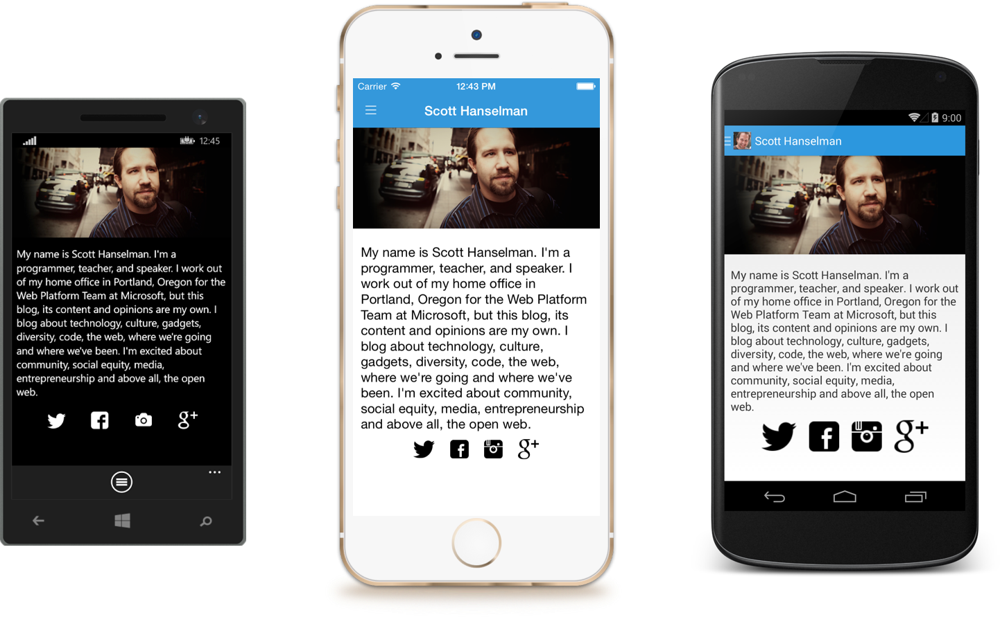
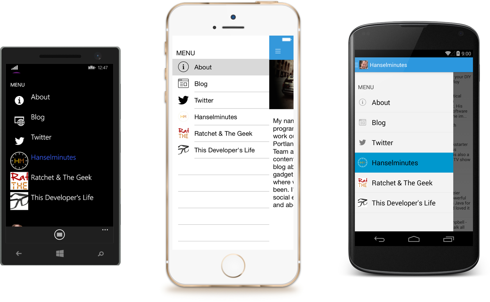
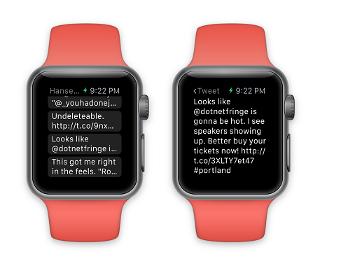

Hanselman Starter Project for Visual Studio 2015
===============

This repository is a fork of https://github.com/jamesmontemagno/Hanselman.Forms converted to a Visual Studio 2015 project template called Hanselman Starter Project.  Its main purpose is to help new cross-platform projects hit the floor running with a framework based on the original sample Hanselman app (see below). 

To manually install this template into your Visual Studio:
---------------

1. Download [HanselmanStarter.zip](https://github.com/AweSamNet/Hanselman.Forms-Starter-Project-Template-for-VS-2015/raw/master/HanselmanStarter.zip)
1. Copy it to `C:\Users\{your-user-account}\Documents\Visual Studio 2015\Templates\ProjectTemplates`
1. The template can be found in Visual Studio 2015: `File -> New -> Project -> Visual C#`

Hanselman.Forms: Hanselman Everywhere
===============

Built with C# 6 features, you must be running VS 2015 or Xamarin Studio to compile.

The most awesome Hanselman app built in about 4 hours to showcase a sample of [Xamarin.Forms](http://www.xamarin.com/forms). Be sure to read [Scott's](http://www.twitter.com/shanselman) blog: http://www.hanselman.com/blog/XamarinFormsWriteOnceRunEverywhereANDBeNative.aspx

In this sample Hanselman app we show awesome information about the awesome man who is Scott Hanselman including reading in his blog & parsing with XDocument. Additionally, I use Linq2Twitter PCL to grab all of Scott's tweets, all using a nice MVVM Style and nearly 100% code reuse.

To learn more about Xamarin.Forms visit: http://www.xamarin.com/forms

To learn about developing native iOS, Android, and Windows apps in C# visit: http://www.xamarin.com

Screenshots - iOS, Android, & Windows Phone
===

Windows Store Preview
===
Xamarin.Forms is now available in PREVIEW for Windows Store and Windows Phone 8.1 RT platforms. You can see a full example now for Hanselman.Forms and read the full documentation at: http://developer.xamarin.com/guides/cross-platform/xamarin-forms/windows/getting-started/

Android Wear
===
To setup Android wear simply install the main Hanselman app on your Android Phone and then the **WearApp** on your Android Wear device. HanselWear uses Google Play Services to synchronize Tweets from the main application. The code for this sync can be found in WearService.cs.

To find out more how to get started with Android Wear with Xamarin please visit: http://developer.xamarin.com/guides/android/wear/

Apple Watch
===
HanselWatch uses simple app group data to sync tweets. You must setup an app group id in your developer portal. To find out more about creating Apple Watch apps with Xamarin please visit: http://developer.xamarin.com/guides/ios/watch/

